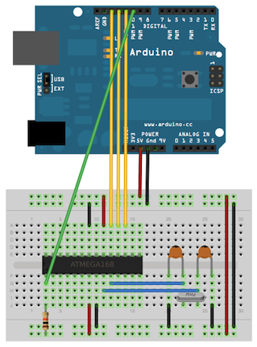

---
title: Arduino as ICSP - Programmeur pour microcontrôleurs atmel
author:
- Jérémy Cochoy
date: 2012/05/25
...

ICSP?
=====

ICSP (In-Circuit Serial Programming) ou encore ISP est le nom donné à l’interface de programmation des microcontroleurs pouvant être reprogrammé _in- situ_. C'est le cas des AVR de chez Atmels, dont figure la très célèbre famille des Atméga (Atmega328P pour la carte arduino uno), mais aussi les petits ATtiny, qui n'ont que peux à envier aux atméga, puisque pouvant surpasser la cadence des seconds (20Mhz pour l'attiny84 et l'attiny85).

Sachez que si vous disposez d'une carte arduino, vous ne programmez pas votre microcontroleur grace à l'ICSP, mais grâce au bootloader arduino, qui a chaque démarrage (appuis sur reset si vous préférez, ou mise sous tension) attend quelques instant une éventuelle communication sur les pins 0 et 1 (RX et TX) avant de finalement lancer votre programme(sketch). Vous l'aurez comprit, la programmation d'une arduino se fait en effectuant un reset et en transmettant les données sous la forme d'une liaison série asynchrone (<http://fr.wikipedia.org/wiki/UART>).

L'inconvénient de cette méthode, est qu'un microcontroleur "brute de fonderie" ne permet pas une telle chose (C'est, un fait à mettre en parallèle avec les PIC et les PICAXE) et qu'il faut donc charger le bootloader arduino.

Une autre raison, plus pragmatique, est que le bootloader arduino mange tout de même plus d'une page mémoire, et que dans certains cas -- ce qui ne m'est pour le moment encore jamais arrivé -- il peut être utile de gagner quelques précieux octets.

La programmation atmel se fait via une interface SPI, Serial Peripherical Interface -- et c'est là que l'ordre des lettres dans un acronyme fait de grande différences (<http://en.wikipedia.org/wiki/Serial_Peripheral_Interface_Bus>).

Arduino as ISP
--------------

Par chance, des gens bien veillant se sont ouvert les veines -- ou pas ... -- pour implémenter un programmateur ISP à travers la carte arduino. Concrètement, l'utilisation du sketch Arduino As ISP (disponible dans la rubrique 'exemples' de l'IDE arduino) permet de transformer la carte arduino en un programmateur ISP, dialoguant avec le PC d'une façon _standard_ -- compenez que les utilitaires pour avr comme avrdude arrivent a communiquer avec l'arduino -- et pouvant pogrammez un microcontroleur atmel... si vous avez de la chance.

Retenez qu'un programmateur ISP d'atmels doit avoir le contrôle sur 4 pins du composant : Le pin reset, car le protocole de programmation demande de pouvoir faire des _choses bizarres_ avec ce dernier, et les 3 pins SPI (MISO, MOSI et SCLK. On n'utilise pas le SS). Le cablage de votre arduino avec un atmega est décrit :

- Dans le code de l'Arduino As ISP; les pins utilisé par le sketch sont indiqué.
  Y figure aussi au port 9 un "heartbeat" qui permet de savoir quand votre sketch
  a planté -- ce qui arrive plus souvent qu'on le souhaiterais.
- À cette adresse, dont l'image suivante est tirée : <http://arduino.cc/en/Tutorial/ArduinoToBreadboard>

Voici donc le schéma d'un montage avec votre arduino comportant le sketh Arduino As ISP, pour programmer un atmega328p (Si vous voulez programmer un autre atmel, il suffit de rechercher les port MOSI, MISO, SCLK et reset, puis de cabler comme sur l'atmega328p).



Sachez que, pour ma part, j'ai du modifier le sketch d'Arduino As ISP, en changeant le baud-rate de la liaison série (avec le PC) à 9600 (par défaut 12900), pour que tout se passe bien. (La pemiere ligne de setup() :   Serial.begin(19200); )

Hologe?
-------

Si la résistance de pull-up sur le reset n'est pas obligatoire, pour un microcontroleur sortie de l'usine, il se peut que vous aillez besoin d'une horloge externe. L'horloge externe ou interne se configure via les fuses (fusibles), des registres spéciaux que le peut modifier... via ICSP -- donc, une fois que vous aurez réussi à faire fonctionner tout ce beau monde, ce qui ne nous aide pas.

Pour ma part, j'ai été obligé d'ajouter une horloge externe pour avoir une réponse du microcontroleur lorsqu’on lui demande d'épeler son nom (signature du composant). Un simple crystal 16MHz avec deux condensateurs 22pF -- non, ça ne marche pas avec 22nF, ce n'est pas faute d'avoir essayé... -- feras l'affaire. Il est fort probable qu'un crystal à 8MHz convienne aussi -- avec les mêmes condensateurs.

Let's GO!
---------

Votre sketch est sur votre arduino, votre circuit est opérationnel, vous avez vérifier chaque câble, chaque branchement, et relut le schéma 8 fois? Bien, alors revérifiez encore une fois*.

Installez la suite AVRtools (WinAVR pour windows, votre gestionnaire de packets sous linux, et pour les autres, à vous de vous débrouiller :D ) -- documenté à cette adresse : <http://www.nongnu.org/avr-libc/user-manual/using_tools.html>

Lancez avrdude, avec une commande de cette forme :
```{.shell}
avrdude -p atmega328p -c avrisp -P com4 -b 9600
```
Où vous remplacez atmega328p par votre microcontroleur, et com4 par votre port. Pensez aussi a entrer le baud-rate (-b) figurant dans le code du sketch Arduino As ISP. Si tout vas bien (Vous devez obtenir une réponse de votre microcontroleur, et les noms attendu et reçu doivent correspondre), vous pouvez alors envoyer un sketch avec :
```{.shell}
avrdude -p atmega328p -c avrisp -P com4 -b 9600 -U flash:w:sketch.hex
```
Pour plus de détailles sur avrdude, référez vous à la documentation, ou bien <http://www.ladyada.net/learn/avr/avrdude.html>.

Sur ce, amusez vous bien :)

*Reflet d'acide joke : huit, ça suffit.

__Nb :__ Pour calculer les fuses, j'utilise <http://www.engbedded.com/fusecalc>.
