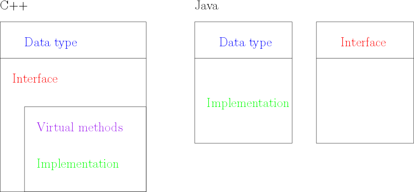

---
title: Haskell - Lazy IO
author:
- Jérémy Cochoy
date: 2017/02/17
...

Object paradigm VS cathegoric paradigm : what is wrong with the object paradigm.
================================================================================


> The object paradigm is fondamentally wrong

If you are curious about programming languages and divers paradigms, you probablyu eard or read this sentence more than once.
THrough those lines, I'll try to draw a picture of the main reason that can lead to this conclusion.
What are the good side and wrong side of OOP, and how we can improve this paradigm by tuning it a little bit.
This nice "tunning" is actually already part of some languages, and i'll refer to it as the 'category paradigm'.

Where does the object paradigm comes from?
------------------------------------------

First, let's recall how, historically, we came to the object paradigm.
We are in the late 70s. The C language is now famous as it completely changed the way to write code compared to assembly, is human readable and have a monstruous expressivity in only few language words  and
he procedural paradigm[^procedural-paradigm] (the one you use while writting C) is well understood.
But, as applications grow and get an increassing size, developpers are facing an increassingly common problem : the code 's complexity is growing exponentially, and code gets harder and harder to write (it still sounds like a today's problem, right? :-) ).
The object paradigm was developped, expecting to solve the complexity curse. Here came OBJC and C++, both in 1983.

Saddly, we know today that OOP wasn't the Holly graal. But what did made peaples bealive that it would be, and why is OOP still used today?

The hopes of OOP
----------------

What came out from a lots of procedural developpement is that you often have types that describe some complexe structure (for example, lists in C are build of chained cells, each cell composed of a value and a link to the next cell) and functions operating on this type (using the same example, function for initialising empty list, destroying list, inserting into this list and removing value from it, etc.).
Once you have spoted this coding pattern, it sounds raisonable to formalise it so that you don't always have to rewrite it by hand, each time.
Indeed, this is the best way to involve : spot a pattern that peaple do mechanicaly, and automatise it. It worked for the automobile industry, and it palso did for computer developpement. Automatisation, from shell script... to new programming languages.

Genese of OOP
-------------

This was the genese of the object paradigm.
We call a such data type an object, add an
initialisation procedure always called at initialisation,
and an other one always called when the resource become unreachable.
Namely, OOP's constructor and destructors.
Because we always have a lot's of metode related to this object that
always need as argument this object,
we add them to the type definition and call them methods.

Here is an example of the C object pattern :
``` {.c}
struct object_type {
    int value1;
    int value2;
    char* ptr;
};

void initialize_object(struct object_type* obj) {
    obj->value1 = 7;
    obj->value2 = 3;
    obj->ptr = calloc(42, sizeof(char));
};

void release_object(struct object_type* obj) {
    free(obj->ptr);
}

int do_stuff(struct object_type* obj, int input) {
    obj->value1 += input;
    obj->value2 += 2;
    return obj->value1 + obj->value2;
};

//...
struct object_type obj;

{
    initialize_object(&obj);
    do_stuff(&obj, 5);
    release_object(&obj);
}

```

And the same thing now in C++:

``` {.cpp}
class Object {
public:
    Object();
    ~Object();
    int do_stuff(int input);
private:
    int value1;
    int value2;
    char* ptr;
};

Object::Object()
    :value1(7), value2(3) {
    ptr = calloc(42, sizeof(char));
};

Object::~Object() {
    free(obj->ptr);
}

int Object::do_stuff(int input) {
    value1 += input;
    value2 += 2;
    return value1 + value2;
};

//...
{
    Object obj;
    obj.do_stuff(5);
}
```

This example is quite simple, and show how object paradigm is applied both in C and C++ languages.
The second language is a lot more error-proof thanks to the support of the paradigm _in_ the language.

Now you might interupt me and argue 'object paradim isn't just about methods glued to a type'.
And you would be right. I swept under the rug _inheritence_.
This feature actually comes from an other spotted codding patters C developers was also doing quite frequently.
You reproduce the inheritence by agregating types, and using pointer arithmetic, as shown below.

``` {.c}
struct A {
    int u;
};

struct B {
    struct A parent;
    int v;
};

struct C {
    struct A parent;
    int w;
};

struct B obj_b;
struct C obj_c;
// Upcasting
struct A* p = (void*)&obj_b.parent;
struct A* q = (void*)&obj_c.parent;

```

The same code in C++ would be:

``` {.cpp}

// In C++, the struct keyword is like the class keyword,
// but all elements are by default public.

struct A {
    int u;
};

struct B : public A {
    int v;
};

struct C : public A {
    int w;
};

B obj_b;
C obj_c;
// Upcasting
A* p = &obj_b;
A* q = &obj_c;

```

Introducing this featre in the language ensure automatic conversion from B* to A* with the right pointer arithmetic.
It remove the risk of often hard to spot bugs.
Inheriting doesn't apply only to type, it apply to methodes. You can call mathode working with a type A on instance of type B. This is the key reason of this pointer conversion.

The languages C++ and Java alow something even stronguer than reusing methode for subtypes in inheritence hierarchy. Through abstract methods, or Java's interface, you can force the existence of methods on a given type. Such that the behavior can be different with different types,
but the interface to work on them remind the same. Allowing huge code factorisation and genericity of algorithms.

So why is OOP wrong?
--------------------

Before saying anything, I want to show you how does object looks like in different mainstream languages.



Of course, you can make schemes similar to java in C++ ; interface are obtained through abstract class.
It's just that the language doesn't prevent you from gluing too much things together (but that's actually part of the C++ philosophy : allow to do as much thing as you can imagine, but you have to make carefully your design decisions).

Looking at the scheme, we see that always, in both languages, type definition and methode definitions are glued togever.
You __can not__ define a type and later, in a completely independent way, implement methodes for this type.
Actually, if C++ and Java are the only object languages you have heard about, my last sentence might sounds realy strange for you (even maybe sounds like non-sence).
But notice that in D, you __can__ implement something relly similar to methodes in a complementaly independent way of type definition.
Why would you do that? Let me give you a tasty example.

A guy (let call him A) make a colorfull library describing tasty chocolate biscuits.
Here is a little bit of his library.
```
Biscuit -> Cookie -> FullChocolateCookie
                  -> WhiteAndBlackCookie
        -> Oreo
```
He thing a lots about cooking such wonderfull wonders, an implement many sophisticated methods.

Now an other guy (named B) just discovered the best way to eat biscuits,
so that you can really enjoy all the taste and perfum they carry.
Not only for chocolate biscuits, but for any biscuit in the world.
He implement many new biscuit, and their _eat_ method.
But in those languages, his only way to add a _eat_ method to A's cookies is to either:
  * Re-implement all the biscuit A did in his library, or modify A's library to add his eat method,
  * Encapsulate the A library in some container, like a 'biscuit metal box', which is definitively not as easy to eat (especialy because metal tends to be harder your teeth).

If you developpe library and re-use existing libraries, that's a problem you probably already encountered many times.

This is because there is actualy no good reason to enforce (Java style) interface implementation where type definition occures.
This is the first big issue comming from the way object model is implemented __and__ conceived in developper's mind.

The second big issue, related to the way OOP is done today, is the huge verbosity and boilerplate code introduced by encapsulation. Good books like 'effective C++'[^effective-cpp] even recommand doing so.
You see it everiday, from getter and setter mostly doing one-line affectation (many ide have tools for automating this code generation) to constructor only forwarding argument to member variables. I really like the following example from LLVM's documentation:
``` {.cpp}
AST Bidule {
    ASTBidule(t1 a, t2 b, t3 c)
    :a(a), b(b), c(c) {};

    t1 a;
    t2 b;
    t3 c;
};
```

So much redundancy. Have a look at LLVM's example for heavily verbose C++ code (that is actually good C++ practice...).
Each variable's name is writen three times.
I would say that this code is three times longuer that it should be (I mean, if we was living in a perfect world).
But there isn't a better way to do it, comforming to usual understanding of OOP.
If so, LLVM's developper would have found it and spreed the word.


[^procedural-paradigm]: Procedural paradigm means essentially that the language provide functions with side effects, and code is written linearly.
    You can see it like an enhencement of languages that only provide goto and jumps.
[^effective-cpp]: This is a really good book on good programming advices for C++ developper. Despite the critic made in this article, it's definitively a book full of good practices.
