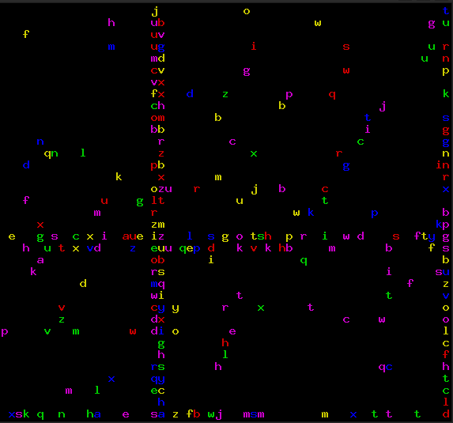

Title: A termcap library, for handling particles animation in terminals.
Author: Jérémy Cochoy
Date: 2009/10/24

Bonsoir,

Alors oui ça ne sert pas à grand chose, mais on peut assez facilement s'amuser à afficher des particules de manière fluide, le tout sans affichage graphique.

Plus que des mots, un exemple basique d'utilisation :

Les sources sont maintenant disponible dans le dépôt git <https://github.com/Zenol/mlc-termcap>.
