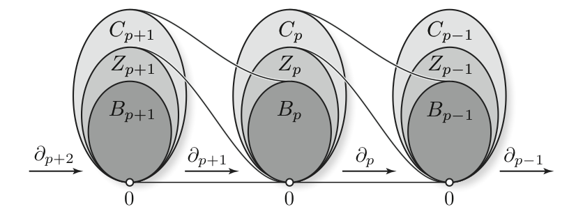

Research activity
=================

Status :
--------

I am a PhD sstudent at INRIA-Saclay, in France located near Paris.
My research focus on __Persistence Modules__.

Research field :
----------------

I study persistent homology.

I am interested by linear representations of certains quiver, usualy obtained from partialy ordered set.

For example, one can consider the category $(\mathbb{R}, \leq)$ composedof the
reals number with their ususal ordering.
A functor $(\mathbb{R}, \leq) \rightarrow Vect$ with values
in the category of vector spaces is then called a _persistence module_.

One can also consider sub-sets of $\mathbb{R}$ like $\mathbb{N}$ or $\mathbb{Z}$.

This functor are naturaly modules over a certain ring (in the case of $\mathbb{N}$, the ring is $k[x]$).

If we allow more dimensions by taking as index set
$(\mathbb{R}^n, \leq)$ with $(x_1, \dots, x_n) \leq (y_1, \dots, y_n) \Leftrightarrow x_1 \leq y_1, \dots$, we then speak of multipersistence.

If the order alternate, for example consider the quiver given by $0 \leq 1 \geq 2 \leq 3 \geq \dots$, it is called zigzag persistence.

We speack of persistent homology because this functor, with values in the category of vector spaces, is obtain by computing the homology of a filtered topological space.
The simplest construction consist of taking a point cloud $P \subset \mathbb{R}^m$,
and then computing the sub-levelset of the (euclidean for example) distance function to the point cloud: $X_k = d^{-1}_P(]-\infty, k])$. This collection of sets is called a filtration.
We obtain our persistence module by applying the homology functor $\mathbb{N}$ : $H(X_0) \rightarrow H(X_1) \rightarrow \dots$.

I'm looking for decomposition theorems and stability results for the signature made from this objects.

--------------------------------------------------

Papers :
----------

* [Decomposition of exact pointwise finite dimensional persistence bimodules](https://arxiv.org/abs/1605.09726) J. Cochoy, S. Oudot.

